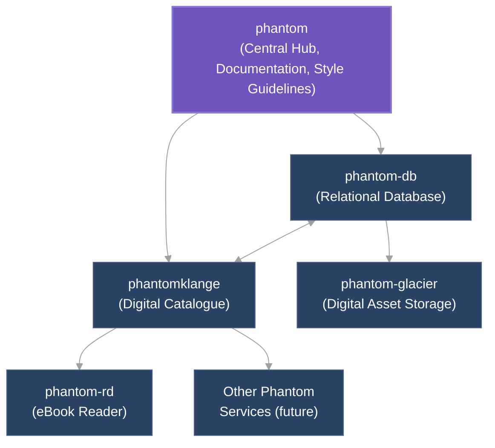
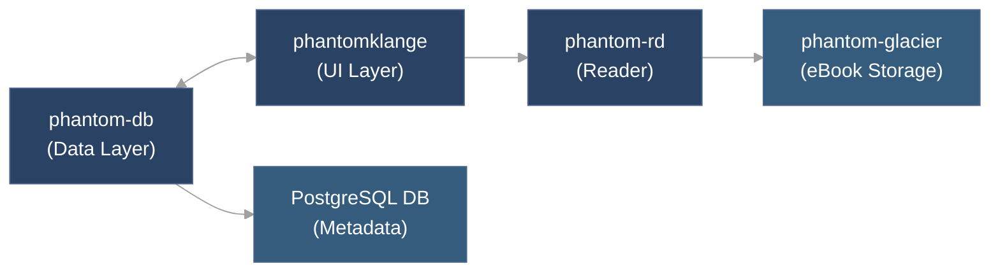

# Phantom System Architecture Overview

The Phantom system is a comprehensive digital platform for organizing, exploring, and interacting with a curated collection of art and literature. This document provides an overview of the system architecture.

## Core Components

The Phantom system comprises several interconnected components:

### phantom (Central Hub)

The phantom repository serves as the central coordination point for the entire system. It provides:

- **Documentation Hub**: Central repository for all system documentation
- **Design System**: Shared UI component library, typography, color palettes, and design tokens
- **Development Standards**: Coding standards, linting configurations, and type definitions
- **Deployment Configuration**: Docker Compose files and NixOS configuration

### phantom-db (Database Layer)

The phantom-db component provides the relational database that serves as the central source of truth for all structured metadata. It includes:

- **Data Model**: Entity definitions for objects, contributors, tags, and essay content
- **Database Access Layer**: Type-safe query interface and validation schemas
- **Library Interface**: Functions for CRUD operations with TypeScript type definitions
- **Schema Management**: Database migration system and seed data

### phantomklange (Digital Catalogue)

The phantomklange component provides the web-based interface for browsing, searching, and exploring the art catalogue. It features:

- **User Interface**: Home page, detail pages, contributor profiles, essay display, and archive
- **Content Management**: MDX-based essay system and asset management
- **Integration**: Integration with phantom-db and phantom-rd
- **Performance Optimization**: Static generation and server-side rendering

### phantom-rd (eBook Reader)

The phantom-rd component provides a standalone eBook reader application that integrates with phantomklange. It includes:

- **Reader Interface**: EPUB rendering, table of contents, and reading progress tracking
- **Integration**: Deep linking from phantomklange and access to books via phantom-glacier
- **Performance**: Fast file loading and offline capabilities

### phantom-glacier (Digital Asset Storage)

The phantom-glacier component (planned) will handle the storage and delivery of digital assets like eBooks, images, and other media files.

## Data Flow Architecture

## Component Communication Patterns

1. **phantom-db to phantomklange**
   - Direct library imports (no HTTP API)
   - Type-safe function calls
   - Prisma client for database access

2. **phantomklange to phantom-rd**
   - External linking or embedding
   - URL-based parameter passing
   - Potential iframe integration

3. **phantom-rd to phantom-glacier**
   - Direct asset access
   - API-based content retrieval
   - Caching for performance

## Technical Standards

- **TypeScript** for all code with strict typing
- **Component-based** architecture with clear separation of concerns
- **Testing** requirements for all components (unit, integration, e2e)
- **Performance** optimization for database queries, asset delivery, and caching

## Development Roadmap

1. **phantom & phantom-db** (foundational components)
2. **phantomklange** (user-facing application)
3. **phantom-rd** (specialized functionality)

## Open Questions

1. **Authentication System**: Design of centralized user authentication
2. **Asset Storage**: Detailed requirements for phantom-glacier
3. **Service Communication**: Direct library access vs. API-based communication
4. **Deployment Architecture**: Production strategy and scaling approach
