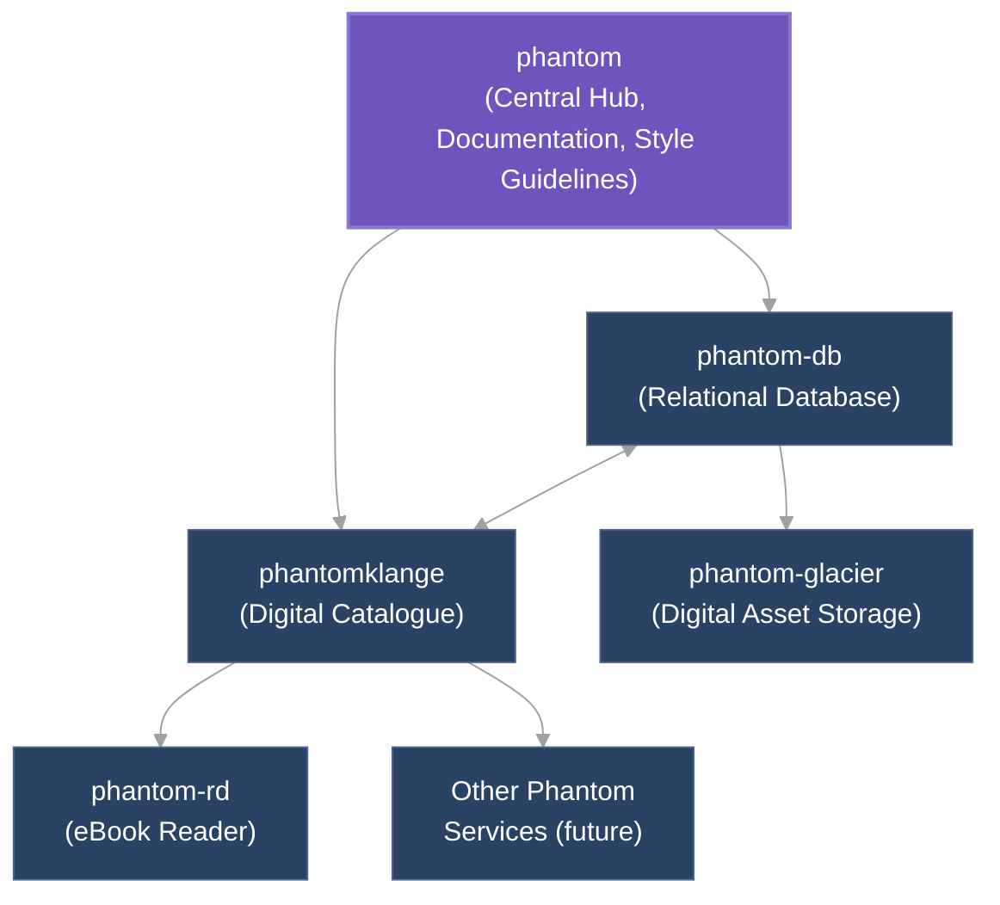
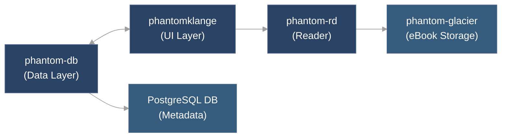

# Phantom System Requirements Document

## 1. System Overview

### 1.1 Vision
The Phantom system is a comprehensive digital platform for organizing, exploring, and interacting with a curated collection of art and literature. The system emphasizes high performance, extensibility, and modular design while maintaining seamless integration between components.

### 1.2 Core Architecture


## 2. Component Requirements

### 2.1 phantom (Central Hub)

#### Purpose
Serves as the central coordination point for the entire Phantom system, providing common resources, documentation, and configuration.

#### Core Requirements
1. **Documentation Hub**
    - Central repository for all system documentation
    - Architecture diagrams and component descriptions
    - Integration guides for connecting components
2. **Design System**
    - Shared UI component library
    - Typography, color palettes, and design tokens
    - Common styling through Tailwind configuration
3. **Development Standards**
    - Coding standards for all Phantom repositories
    - Linting configurations
    - Type definitions for shared concepts
4. **Deployment Configuration**
    - Docker Compose files for local development
    - NixOS configuration for standardized environments
    - CI/CD workflow templates

#### Technical Specifications
- **Technology Stack**: Docker, Markdown, NixOS, TypeScript, Tailwind CSS
- **Repository Structure**: Organized by component domain with clear README files

### 2.2 phantom-db (Database Layer)

#### Purpose
Provides a robust relational database that serves as the central source of truth for all structured metadata about the art catalogue.

#### Core Requirements
1. **Data Model**
    - Entity definitions for objects (books, paintings, films, etc.)
    - Contributor information and relationships
    - Tag and categorization system
    - Essay content metadata
2. **Database Access Layer**
    - Type-safe query interface
    - Validation schemas for all entity types
    - Relationship management
3. **Library Interface**
    - Exports functions for CRUD operations
    - TypeScript type definitions for all entities
    - Zero-network-overhead direct database access
4. **Schema Management**
    - Database migration system
    - Seed data for development
    - Validation of data integrity
#### Technical Specifications
- **Technology Stack**: PostgreSQL, Prisma, TypeScript, Zod
- **Repository Structure**:
```
phantom-db/
├── prisma/                    # Prisma schema and migrations
│   ├── schema.prisma          # Database schema
│   ├── migrations/            # Migration files
│   └── seed.ts                # Seed data
├── src/
│   ├── client/                # Database client
│   ├── types/                 # Type definitions
│   └── utils/                 # Utilities
├── __tests__/                 # Tests
└── README.md                  # Documentation
```

- **Performance Requirements**:
    - Query optimization for common access patterns
    - Efficient handling of relationships
    - Support for eventual connection pooling
- **Extension Points**:
    - Schema extensibility for new object types
    - Versioning system for schema changes
    - API for external service access
### 2.3 phantomklange (Digital Catalogue)

#### Purpose
Provides a web-based interface for browsing, searching, and exploring the art catalogue, with rich visualization and content exploration capabilities.

#### Core Requirements
1. **User Interface**
    - Home page with featured content
    - Detail pages for objects (books, paintings, etc.)
    - Contributor profile pages
    - Essay display with MDX rendering
    - Archive with advanced filtering
2. **Content Management**
    - MDX-based essay system
    - Asset management for object images
    - Relationship visualization
3. **Integration**
    - Integration with phantom-db for data access
    - Integration with phantom-rd for eBook reading
    - Support for future service integration
4. **Performance Optimization**
    - Static generation where possible
    - Incremental static regeneration for semi-dynamic content
    - Server-side rendering for highly dynamic content

#### Technical Specifications
- **Technology Stack**: Next.js, React, TypeScript, Tailwind CSS, MDX
- **Repository Structure**:

```
phantomklange/
├── src/
│   ├── app/                      # Next.js App Router
│   │   ├── objects/              # Object routes
│   │   ├── contributors/         # Contributor routes
│   │   ├── essays/               # Essay routes
│   │   └── archive/              # Archive routes
│   ├── components/               # React components
│   ├── lib/                      # Utilities
│   ├── hooks/                    # Custom React hooks
│   └── styles/                   # Global styles
├── content/                      # Content storage
│   ├── essays/                   # MDX essays
│   └── assets/                   # Local assets
├── public/                       # Static assets
└── README.md                     # Documentation
```

**Performance Requirements**:
- First Contentful Paint < 1s
- Largest Contentful Paint < 2s
- Search response time < 100ms

**Extension Points**:
- Plugin system for additional content types
- Integration hooks for new services
- Custom MDX components for rich content

### 2.4 phantom-rd (eBook Reader)

#### Purpose
Provides a standalone eBook reader application that can be integrated with phantomklange to allow users to read full books.

#### Core Requirements
1. **Reader Interface**
    - EPUB rendering with page navigation
    - Table of contents display
    - Reading progress tracking
    - Annotations and bookmarks
2. **Integration**
    - Deep linking from phantomklange
    - Access to books via phantom-glacier
    - Shared styling with Phantom design system
3. **Performance**
    - Fast file loading and rendering
    - Support for large documents
    - Offline reading capabilities

#### Technical Specifications
- **Technology Stack**: To be determined based on implementation requirements (likely React-based)
- **Integration Pattern**: Standalone application with embedding capabilities

### 3.1 Data Flow Architecture


### 3.2 Component Communication Patterns

1. **phantom-db to phantomklange**
    - Direct library imports (no HTTP API)
    - Type-safe function calls
    - Prisma client for database access
2. **phantomklange to phantom-rd**
    - External linking or embedding
    - URL-based parameter passing
    - Potential iframe integration
3. **phantom-rd to phantom-glacier**
    - Direct asset access
    - API-based content retrieval
    - Caching for performance

### 3.3 Authentication & Authorization

A future centralized authentication system will be designed to provide:
- Single sign-on across all Phantom services
- Role-based access control
- API tokens for service-to-service communication

## 4. Technical Standards

### 4.1 Development Standards
- **TypeScript** for all code with strict typing
- **Component-based** architecture with clear separation of concerns
- **Testing** requirements for all components (unit, integration, e2e)

### 4.2 Performance Requirements
- Database queries optimized for common use cases
- Asset delivery through CDN
- Progressive loading for large content
- Caching strategy for repeated content

### 4.3 Extensibility Guidelines

- Clear extension points in all components
- Modular design for adding new features
- Documentation for integrating new services

## 5. Development Roadmap

### 5.1 Priority Order
1. **phantom & phantom-db** (foundational components)
    - Establish data models and access patterns
    - Set up central documentation and standards
2. **phantomklange** (user-facing application)
    - Implement core browsing and exploration features
    - Establish content management workflows
3. **phantom-rd** (specialized functionality)
    - Implement standalone eBook reader
    - Integrate with phantomklange

### 5.2 Minimum Viable Product (MVP)

#### phantom MVP
- Core documentation structure
- Design system fundamentals
- Development standards documentation

#### phantom-db MVP
- Essential data models (objects, contributors, essays)
- CRUD operations for all entities
- Basic relationship management
- TypeScript type definitions

#### phantomklange MVP
- Home page with featured content
- Object detail pages for core types
- Contributor profiles
- Basic essay rendering
- Simple archive with filtering

## 6. Open Questions & Future Decisions

1. **Authentication System**
    - Design of the centralized user authentication system
    - Integration patterns for existing components
2. **Asset Storage**
    - Detailed requirements for phantom-glacier
    - Optimization strategies for digital assets
3. **Service Communication**
    - Decision on direct library access vs. API-based communication
    - Potential service mesh for larger system
4. **Deployment Architecture**
    - Production deployment strategy
    - Scaling approach for high-traffic scenarios