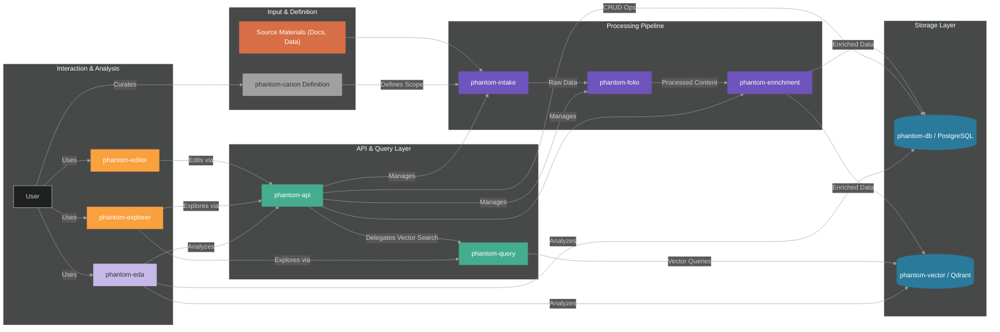

# Phantom

<div align="center">

*An open-source initiative to build a deeply interconnected, queryable digital canon of human art and thought.*

</div>

<br/>
<div align="center">───────  §  ───────</div>
<br/>

## Vision & Motivation: Curating a Digital Canon

In an age awash with ephemeral content and algorithmic noise, Phantom seeks to carve out a space for enduring works of human creativity and intellect. We face a deluge of information, the fragmentation of cultural memory, and the rise of "AI slop"—content endlessly remixed without grounding in original substance. It's increasingly difficult to connect with the foundational art, literature, and ideas that shape our understanding of ourselves and the world.

Phantom is our response: an ambitious project to build an **open-source, canonical library**. We are not aiming to catalog *everything*, but rather to meticulously curate a collection of significant works – the touchstones of art, literature, philosophy, and science – and transform them into a unified, deeply interconnected knowledge graph.

Our core motivations are:

-   **Combat Information Overload:** Provide a focused, high-signal resource amidst the noise, prioritizing depth and significance over sheer volume.
-   **Preserve & Rediscover:** Create a persistent, accessible digital home for canonical works, safeguarding them against cultural amnesia and making them newly discoverable.
-   **Enable Deep Exploration:** Move beyond keyword search. Allow users to explore the semantic relationships, thematic resonances, and intricate connections *between* works across different domains and eras.
-   **Foster Meaningful Analysis:** Build a structured, vectorized representation of the canon, enabling novel forms of computational analysis, visualization, and understanding.
-   **Offer an Open Resource:** Provide this curated and structured knowledge base as an open-source platform for researchers, students, artists, and the intellectually curious public.

Phantom aims to be more than a digital archive; it aspires to be a dynamic engine for exploring the heights of human expression and thought.

<br/>
<div align="center">───────  §  ───────</div>
<br/>

## High-Level Architecture

Phantom employs a modular, service-oriented architecture to manage the lifecycle of canonical data, from ingestion and structuring to enrichment, storage, and exploration.




-   **Definition:** `phantom-canon` outlines *what* belongs in the library.
-   **Ingestion & Processing:** `phantom-intake` captures raw source material, `phantom-folio` converts formats (e.g., PDF to structured text), and `phantom-enrichment` adds metadata and connections.
-   **Core Storage:** `phantom-db` (PostgreSQL) stores structured metadata and relationships. `phantom-vector` (with Qdrant) stores semantic vector embeddings for similarity search.
-   **Access & Interaction:** `phantom-api` serves as the central gateway for data management and retrieval. `phantom-query` specializes in handling vector search requests.
-   **User Interfaces & Analysis:** `phantom-editor` allows curation and data modification. `phantom-explorer` provides the interface for browsing and discovering connections. `phantom-eda` contains tools and notebooks for deeper analysis.

<br/>
<div align="center">───────  §  ───────</div>
<br/>

## Phantom Projects Overview

The suite is composed of the following services and repositories, organized logically by function:
<br/>

| Project                                                                             | Description                                                                                               | Technologies        |
| :-------------------------------------------------------------------------------------------------- | :-------------------------------------------------------------------------------------------------------- | :----------------------------------- |
| [****phantom****][1] <br/>  | Central entry point, documentation hub, and orchestration layer.                                          | Docker Compose, Markdown, NixOS      |
| [****phantom-canon****][2] <br/>  | Consolidation and definition of the human canon criteria and sources.                                     | Python, Markdown, Git, YAML          |
| [****phantom-intake****][3] <br/>  | Ingestion platform for acquiring and initially processing source materials.                                 | Python, Apache Airflow, S3, Docker   |
| [****phantom-folio****][4] <br/>  | Document conversion pipeline (e.g., PDF/OCR → Structured Text/EPUB).                                      | Python, FastAPI, Celery, Tesseract   |
| [****phantom-enrichment****][5] <br/>  | Engine for adding metadata, linking entities, and enriching content.                                  | Jupyter, spaCy, NLTK, Python         |
| [****phantom-db****][6] <br/>  | Robust relational database system (PostgreSQL) storing structured metadata.                               | PostgreSQL, SQLAlchemy, Alembic, Py  |
| [****phantom-vector****][7] <br/>  | Vectorization engine creating embeddings using models like Sentence Transformers.                           | PyTorch, Sent. Transformers, Qdrant  |
| [****phantom-api****][8] <br/>  | Central API gateway for interacting with all backend Phantom services.                                      | FastAPI, Python, JWT, OpenAPI        |
| [****phantom-query****][9] <br/>  | Specialized service for executing vector similarity searches against Qdrant.                                | Python, FastAPI, LangChain, Redis    |
| [****phantom-editor****][10] <br/>  | Web application for curators to manage, edit, and annotate canon content.                                   | React, TypeScript, Draft.js, Tailwind|
| [****phantom-explorer****][11] <br/>  | Web application for users to browse, search, and visualize the canon.                                     | React, TypeScript, D3.js, Tailwind   |
| [****phantom-eda****][12] <br/>  | Repository for exploratory data analysis, experiments, and visualizations related to the canon data.        | Jupyter, Pandas, NumPy, Matplotlib   |

<!-- Repository Links -->
[1]: https://github.com/Phantomklange/phantom
[2]: https://github.com/Phantomklange/phantom-canon
[3]: https://github.com/Phantomklange/phantom-intake
[4]: https://github.com/Phantomklange/phantom-folio
[5]: https://github.com/Phantomklange/phantom-enrichment
[6]: https://github.com/Phantomklange/phantom-db
[7]: https://github.com/Phantomklange/phantom-vector
[8]: https://github.com/Phantomklange/phantom-api
[9]: https://github.com/Phantomklange/phantom-query
[10]: https://github.com/Phantomklange/phantom-editor
[11]: https://github.com/Phantomklange/phantom-explorer
[12]: https://github.com/Phantomklange/phantom-eda

<br/>
<div align="center">───────  §  ───────</div>
<br/>

## This Repository (`Phantomklange/phantom`)

This repository serves as the **central entry point, documentation hub, and orchestration layer** for the entire Phantom Suite. It **does not contain the core source code** for the individual components listed above but integrates them.

Its primary contents are:

-   **Documentation:** This `README`, architectural details, design rationale (`docs/`).
-   **Orchestration:** `docker-compose.yml` and related configuration (`*.env.example`) for setting up and running the suite locally. Often leverages Nix Flakes for reproducibility.

<br/>
<div align="center">───────  §  ───────</div>
<br/>

## Getting Started (Local Development via Docker Compose)

These instructions outline how to run the core components of the Phantom Suite locally using Docker and Docker Compose.

**Prerequisites:**

*   Git
*   Docker Engine
*   Docker Compose
*   (Optional) Nix package manager if leveraging Nix Flakes defined in this or other repos.
*   Sufficient RAM/Disk (Check requirements for PostgreSQL, Qdrant, and embedding models)
*   (Optional but Recommended) NVIDIA GPU with NVIDIA Container Toolkit for `phantom-vector` acceleration.

**Steps:**

1.  **Clone Repositories:** Clone this `phantom` repository and the necessary component repositories into a common parent directory. Adjust paths in `docker-compose.yml` if your structure differs.

    ```bash
    # Example Structure:
    # phantom-suite/
    # ├── phantom/ (This repo)
    # ├── phantom-api/
    # ├── phantom-canon/
    # ├── phantom-db/
    # ├── phantom-eda/
    # ├── phantom-editor/
    # ├── phantom-enrichment/
    # ├── phantom-explorer/
    # ├── phantom-folio/
    # ├── phantom-intake/
    # ├── phantom-query/
    # └── phantom-vector/

    git clone https://github.com/Phantomklange/phantom.git
    git clone https://github.com/Phantomklange/phantom-canon.git
    git clone https://github.com/Phantomklange/phantom-intake.git
    git clone https://github.com/Phantomklange/phantom-folio.git
    # ... clone other required repos ...
    cd phantom # Navigate into this repository
    ```

2.  **Configure Environment:** Copy `.env.example` to `.env` in this repository and populate it with your configuration (database credentials, API keys, service URLs, etc.). Check individual component repositories for any additional required environment variables or setup (including potential Nix configuration).
    ```bash
    cp .env.example .env
    # Edit .env with your specific settings
    ```

3.  **Build & Run Services:**
    ```bash
    # If using plain Docker Compose
    docker-compose up --build -d

    # If leveraging Nix Flakes for building/running (example, adapt as needed)
    # nix develop --command docker-compose up --build -d
    ```
    *   This builds and starts the containers defined in `docker-compose.yml`.
    *   Use `docker-compose logs -f <service_name>` (e.g., `docker-compose logs -f phantom-api`) to monitor logs.
    *   *Note:* The default `docker-compose.yml` may only include core services. You might need to customize it to run optional components like front-ends.

4.  **Database Initialization:** After the PostgreSQL container (`phantom-db`) is running, you'll likely need to apply database migrations. Refer to the `phantom-db` repository's documentation for the specific commands (often involving `alembic`).
    ```bash
    # Example command (adjust based on actual setup):
    # docker-compose exec phantom-db alembic upgrade head
    ```

5.  **Access Services:** Consult `docker-compose.yml` and individual project READMEs to find the exposed ports for APIs (`phantom-api`, `phantom-query`), UIs (`phantom-editor`, `phantom-explorer`), or database tools (e.g., Qdrant UI, Adminer/pgAdmin for PostgreSQL). The primary interaction point will likely be `phantom-api`.

**Stopping Services:**

```bash
docker-compose down
```

*(Detailed setup and usage for each component can be found in their respective repositories.)*

<br/>
<div align="center">───────  §  ───────</div>
<br/>

## Future Considerations & Roadmap

-   Formalizing the `phantom-canon` definition and curation process.
-   Full implementation and integration of `phantom-intake`, `phantom-enrichment`, `phantom-api`, and `phantom-query`.
-   Development of the `phantom-editor` and `phantom-explorer` user interfaces.
-   Refinement of data models, vectorization strategies, and cross-linking algorithms.
-   Exploration of advanced analysis techniques within `phantom-eda`.
-   Performance optimization, scalability testing, and robust monitoring.
-   Building a community around the open-source canon.

<br/>

---

*This project is actively under development, driven by a passion for preserving and exploring the core of human artistic and intellectual achievement.*
*Contact: [Pablo Aguirre](mailto:pablo.aguirre@phantomklange.com)*