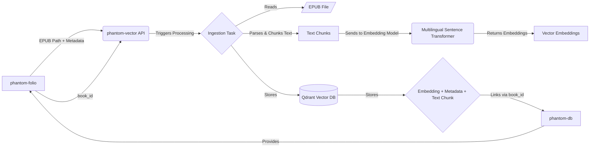

# Phantom-Vector: Semantic Indexing Engine

## Overview

Phantom-Vector is a core module within the Phantom Library project. Its primary responsibility is to ingest structured digital content (initially EPUB books), parse it, generate meaningful vector embeddings, and store these embeddings along with rich metadata in a high-performance vector database.

This module acts as the engine that transforms raw content into a searchable semantic index, forming the backbone for future query interfaces (like semantic search, fuzzy finders, and RAG-based Q&A systems) that allow interaction with the user's entire personal digital library.

## Project Vision

The overarching goal of the Phantom Library project is to create a unified, queryable "digital brain" from a diverse personal collection of digital materials. This includes books, paintings, films, music, notes, and more. Phantom-Vector is the crucial first step in indexing the content layer, starting with textual data.

## Core Functionality (Current Focus: Books)

- **Ingestion:** Receives processing requests for digital text files (specifically EPUBs initially), typically triggered by `phantom-folio` upon successful structuring.
- **Parsing:** Extracts text content and relevant structural metadata (chapters, potential page markers) from EPUB files.
- **Chunking:** Divides the extracted text into smaller, semantically relevant chunks suitable for embedding.
- **Embedding:** Utilizes state-of-the-art (multilingual) sentence transformer models to convert text chunks into high-dimensional vector embeddings, capturing semantic meaning.
- **Storage:** Persists the vector embeddings, the original text chunk, and detailed metadata (source ID from `phantom-db`, title, author, chapter, page numbers, sequence info) into a Vector Database (Qdrant).

## Architecture & Interaction

- `phantom-vector` typically runs as a background service.
- It exposes an API endpoint (TBD) to receive ingestion requests.
- It requires access to the specified EPUB file path.
- It utilizes a configured sentence transformer model (run locally, leveraging GPU if available).
- It connects to a running Qdrant instance to store the indexed data.
- Metadata stored includes a `book_id` to link back to the master registry in phantom-db.

## Technology Stack

- **Language**: Python 3.10+
- **Core Libraries**:
  - `sentence-transformers`: For loading and running embedding models.
  - `qdrant-client`: For interacting with the Qdrant vector database.
  - EPUB Parsing Library (e.g., `EbookLib`, `beautifulsoup4`): For extracting content from EPUBs.
  - API Framework (Optional for trigger endpoint, e.g., `FastAPI`): To receive ingestion jobs.
  - Task Queue (Optional, e.g., `Celery`): For managing background processing jobs robustly.
- **Vector Database**: Qdrant (Open Source Version)
- **Containerization**: Docker & Docker Compose

## Prerequisites (Host Machine - Windows Target)

- **Docker**: Latest stable version.
- **Docker Compose**: Latest stable version compatible with Docker.
- **NVIDIA GPU**: Strongly recommended for acceptable embedding performance. Ensure NVIDIA drivers and NVIDIA Container Toolkit are installed and configured for Docker.
- **Sufficient Disk Space**: Vector databases can grow large. Estimate based on library size (potentially 50GB-200GB+ for 10,000 books).
- **Sufficient RAM**: Qdrant performance benefits significantly from RAM. 16GB+ recommended for the machine running Qdrant, more is better.

## Installation & Setup (Local Docker on Windows)

1. **Clone the repository:**
    
          `git clone [your-repo-url] cd phantom-vector`
        
    
    IGNORE_WHEN_COPYING_START
    

- Use code [with caution](https://support.google.com/legal/answer/13505487).Bash
    
    IGNORE_WHEN_COPYING_END
    
- **Configure Environment:**
    
    - Copy the example environment file: cp .env.example .env
        
    - Edit the .env file with your specific settings:
        
        - MODEL_NAME: The multilingual sentence transformer model to use (e.g., paraphrase-multilingual-mpnet-base-v2).
            
        - QDRANT_HOST: Hostname/IP of the Qdrant service (usually qdrant if using Docker Compose networking).
            
        - QDRANT_PORT: Port for Qdrant (default: 6333).
            
        - DEVICE: Device to use for embedding ('cuda' for GPU, 'cpu' for CPU).
            
        - Potentially paths for data volumes if needed.
            
- **Build and Run Containers:**
    
          `docker-compose up --build -d`
        
    
    IGNORE_WHEN_COPYING_START
    

1. Use code [with caution](https://support.google.com/legal/answer/13505487).Bash
    
    IGNORE_WHEN_COPYING_END
    
    This command will:
    
    - Build the phantom-vector Docker image.
        
    - Pull the official Qdrant Docker image.
        
    - Start both services.
        
    - Mount necessary volumes for data persistence (Qdrant data, potentially model cache).
        

## Usage

- **Ingestion:** The primary usage is triggered externally, likely by phantom-folio. A request (e.g., HTTP POST to the phantom-vector API) should be sent containing:
    
    - The path to the processed EPUB file (accessible by the phantom-vector container, possibly via a shared Docker volume).
        
    - The unique book_id corresponding to the entry in phantom-db.
        
    - Other relevant metadata if not already retrieved via book_id.
        
- phantom-vector will then queue and process the book asynchronously. Logs can be checked via docker-compose logs phantom-vector.
    

## Current Status

- **Focus:** Processing and indexing text content from EPUB files.
    
- **Capabilities:** Text extraction, chunking, multilingual semantic embedding generation, storage in Qdrant with metadata.
    
- **Limitations:** Only handles EPUBs currently. Error handling for malformed EPUBs may need refinement. Performance depends heavily on hardware (GPU for embedding, RAM/Disk for Qdrant).
    

## Future Plans / Roadmap

- **Expand Content Types:**
    
    - Integrate processing for scanned paintings (metadata extraction, potentially image embeddings).
        
    - Integrate processing for song lyrics (text embedding).
        
    - Integrate processing for film metadata/scripts (text embedding).
        
    - Model and ingest data about historical events.
        
    - Model and ingest data about people (authors, artists, etc.) and their relationships.
        
- **Develop Query Service (phantom-searcher):** Build the dedicated service for semantic search, exact search, and context retrieval against the Qdrant index.
    
- **Develop RAG Interface:** Integrate with LLMs for natural language question-answering.
    
- **Refine Parsing:** Improve robustness for handling diverse and potentially malformed EPUBs.
    
- **Performance Optimization:** Fine-tune chunking strategies, embedding models, and Qdrant indexing parameters.
    
- **Monitoring & Management:** Add better status reporting and management tools.
    

## Contributing

(Placeholder for contribution guidelines - e.g., Fork, Branch, PR process)

## License

(Placeholder for License - e.g., MIT, Apache 2.0)